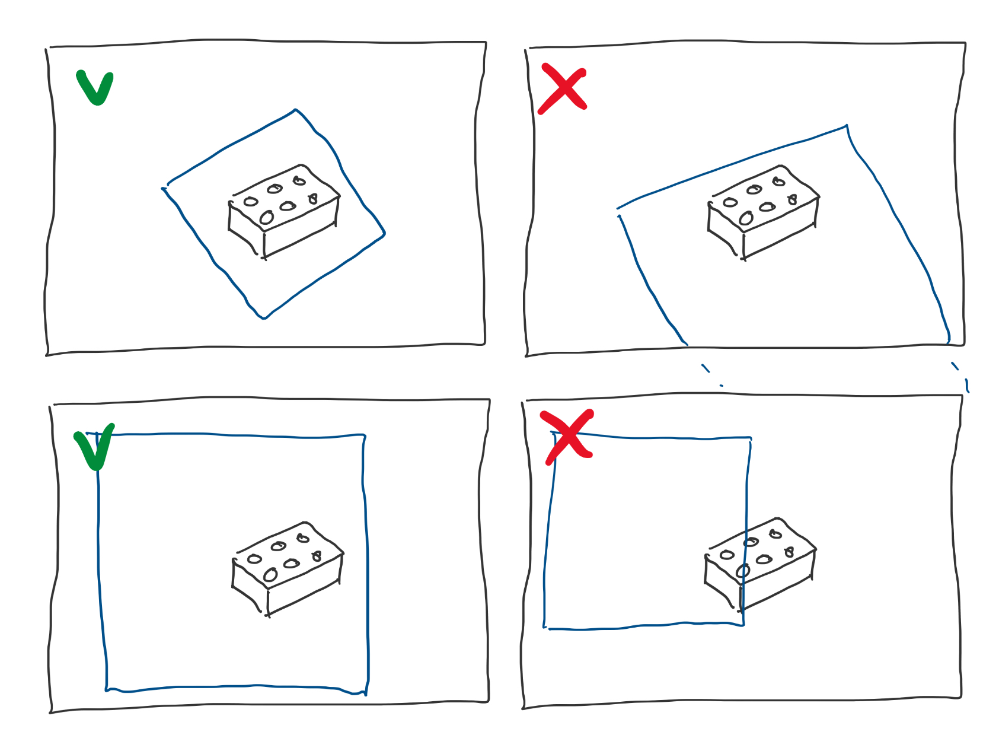

# Задача

При обучении на реальных данных есть типовая проблема - данных мало. Стандартный способ решения такой проблемы - random crop and rotate.

Для решения задачи нужно будет взять пару **исходных изображений**: `IMG_1119.JPG` и `IMG_1119_mask.JPG`

Реализовать метод, который генерирует 100 **обучающих пар**.

* Каждая обучающая пара состоит из двух файлов: реалистичное изображение и маска
* Каждый файл обучающей пары является изображением размера 256х256
* Каждый файл обучающей пары получен вырезанием квадрата случайного размера со случайным поворотом из исходных изображений таким образом, что деталь находится полностью внутри и квадрат лежит полностью внутри изображения. 

Результат работы:

* папка с результирующими изображениями размера 256х256
* Jupyter notebook с кодом генерации результирующих изображений
